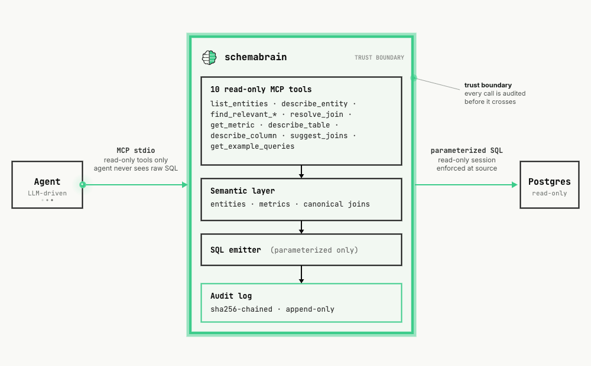

<p align="center">
  <picture>
    <source media="(prefers-color-scheme: dark)" srcset="docs/assets/readme-hero-dark.svg">
    
  </picture>
</p>

<h1 align="center">schemabrain</h1>

<p align="center">
  <a href="https://github.com/Arun-kc/schemabrain/actions/workflows/ci.yml"></a>
  <a href="https://pypi.org/project/schemabrain/"></a>
  <a href="https://pypi.org/project/schemabrain/"></a>
  <a href="https://www.python.org/"></a>
  <a href="LICENSE"></a>
  <a href="https://modelcontextprotocol.io"></a>
</p>

> **The agent never writes SQL. Schema Brain does, from definitions you control.**

A pluggable semantic + SQL firewall for AI agents on Postgres. Your agent only ever sees twelve read-only MCP tools — entity lookup, validated metrics, canonical-join resolution, PII-aware refusal — and Schema Brain compiles and runs the parameterized SQL on its side. Every call lands in a tamper-evident audit log.

- **One command from `pip install` to wired agent** — bare `schemabrain init` walks the 7-stage activation wizard end-to-end. Auto-detects a dbt project and routes through the importer when one is present.
- **Validated metrics, not invented SQL** — entities, metrics, and canonical joins compile to parameterized SQL the agent never sees.
- **Pluggable into any agent loop** — Claude Desktop, Claude Code, Cursor, or your own Anthropic / OpenAI / LangGraph loop over MCP stdio. 230-LOC drop-in proof at [`examples/anthropic_demo.py`](examples/anthropic_demo.py).
- **Watch what the agent does** — `schemabrain tail` streams every tool call live; every call lands in an append-only `mcp_audit` table with a sha256 chain.

```bash
pip install schemabrain
schemabrain init
# then ask your MCP host: "list the entities Schema Brain knows about"
```

**Cost.** ~$0.01 to index the bundled 7-table demo (30 columns) · ~$0.03 for a 87-column Pagila sample · **$0** to re-index unchanged schemas. Bounded by per-stage cost caps; runs on Claude Haiku 4.5.

**Status: 0.3.0 (alpha).** Postgres + SQLite supported today. Snowflake / BigQuery / MySQL on the roadmap. The longer-term position is the SQL-boundary safety layer for AI agents — see [Where it's going](#where-its-going).

---

## Contents

- [Quickstart](#quickstart) — 3 steps from `pip install` to a working agent
- [The firewall](#the-firewall) — what Schema Brain enforces at the SQL boundary
- [Sample session](#sample-session) — real Claude Desktop interaction against the bundled fixture
- [Where it's going](#where-its-going) — honest disclaimer about what's not built yet
- [Roadmap](#roadmap) — shipped + in progress + planned
- [Troubleshooting](#troubleshooting) — the five most common first-run failures
- [Documentation](#documentation) — deeper guides

**Read next based on what you need:**

| Goal | Where to go |
|---|---|
| Try it on the bundled fixture | [Quickstart](#quickstart) |
| Understand the firewall properties | [The firewall](#the-firewall) |
| Plug into your own agent loop | [`docs/setup.md`](docs/setup.md#path-2--anthropic-sdk-demo-no-claude-desktop-required) |
| Build a semantic layer | [`docs/semantic-layer.md`](docs/semantic-layer.md) |
| Run in production (audit, drift, Docker) | [`docs/operations.md`](docs/operations.md) |
| Observe the agent (tail, audit log, OTel) | [`docs/observability.md`](docs/observability.md) |
| Compare with Vanna / Atlan / dbt-mcp / WrenAI | [`docs/landscape.md`](docs/landscape.md) |

---

## Quickstart

Three steps from `pip install` to a working Claude Desktop integration. ~45s once Docker and the embedding model are cached; budget a couple of minutes on a true first run while the `postgres:16-alpine` image and the ~67 MB ONNX embedding model download.

### 1. Install

```bash
pip install schemabrain
schemabrain --version
```

Source install (`git clone` + `uv sync --extra dev`) is documented in [`docs/setup.md`](docs/setup.md#0-activation-wizard-recommended).

### 2. Run the activation wizard

```bash
schemabrain init
```

`init` is a seven-stage wizard that takes you from "I have a Postgres database" to "Claude Desktop can answer questions about it" in one command. On first run it prompts for what it needs:

- **A Postgres URL** — paste your own connection string, or press **Enter** to spin up a local demo Postgres container with the bundled e-commerce fixture (Docker is invoked automatically; idempotent on re-runs).
- **An `ANTHROPIC_API_KEY`** — optional. Skip and the wizard still wires Claude Desktop; entity curation can run later.

```
Schema Brain init — activation wizard

  [1/7] Source check       ✓ source reachable + read-only
  [2/7] Index schema       ✓ 7 tables, 30 columns indexed
  [3/7] Curate entities    ✓ 6 entities suggested + applied (cost: $0.01)
  [4/7] Curate metrics     ✓ 10 metrics suggested + applied (cost: $0.03)
  [5/7] Curate joins       ✓ 5 canonical joins created (FK-mined, no LLM)
  [6/7] Wire host          ✓ wrote schemabrain entry to claude_desktop_config.json
  [7/7] Next               ✓ restart your MCP host, then ask: "list the entities Schema Brain knows about"
```

Full wizard reference (stages explained, flags, dbt auto-detection, `--print-only` for non-Claude-Desktop hosts, `--no-entities` / `--no-metrics` / `--no-joins` opt-outs, cost-cap pauses): [`docs/setup.md`](docs/setup.md#0-activation-wizard-recommended).

### 3. Restart Claude Desktop and ask

1. Quit Claude Desktop fully — **Cmd+Q**, not just close the window. The MCP config is only read on cold start.
2. Relaunch.
3. New conversation:

   > list the entities Schema Brain knows about

If Claude calls `list_entities` and reports `user`, `order`, etc., you're done. If not, see [Troubleshooting](#troubleshooting).

After the wizard, `schemabrain inspect` shows what the agent has and `schemabrain tail` streams every tool call live — see [`docs/operations.md`](docs/operations.md).

---

## The firewall

<p align="center">
  <picture>
    <source media="(prefers-color-scheme: dark)" srcset="docs/assets/schemabrain-architecture-dark.gif">
    
  </picture>
</p>

Four properties Schema Brain enforces at the SQL boundary today — plus one that keeps them portable:

<table>
<tr>
<td width="50%" valign="top">

### 1. Agent never writes raw SQL

Entities, metrics, and canonical joins compile to parameterized SQL Schema Brain runs on its side. The agent sees rows + the SQL that was run — never arbitrary statements at your database.

[Build your semantic layer →](docs/semantic-layer.md)

</td>
<td width="50%" valign="top">

### 2. Read-only enforced at the source

Stage 1 of `schemabrain init` opens the source with `default_transaction_read_only=on` and verifies the session honors it. A Postgres that won't enforce read-only is refused at activation, not at runtime.

</td>
</tr>
<tr>
<td width="50%" valign="top">

### 3. PII-aware refusal at the tool boundary

Any `get_metric` touching a blocked PII category returns a `refused` envelope; the compiled SQL never runs and the refusal lands in `mcp_audit` as `status='refused'`, `refusal_reason='pii_blocked'`. `describe_entity` enforces the same policy at the column level — the agent still sees the entity and its non-PII columns, but blocked columns ship with `redacted=True` and the LLM-enriched description cleared. `schemabrain init` writes `--pii-block contact` into the Claude Desktop snippet by default so email / phone / address columns are blocked on a fresh install; widen with `--pii-block contact,health` and other categories as needed.

```bash
schemabrain serve --pii-block contact,health
```

Twelve categories from GDPR, CCPA/CPRA, HIPAA, PCI DSS, ISO 27018 — tagged per-column at index time.

[PII classification →](docs/observability.md#pii-classification-alpha)

</td>
<td width="50%" valign="top">

### 4. Tamper-evident audit log

Every tool call under `schemabrain serve` writes one row to an append-only `mcp_audit` table with a per-row sha256 chain. Rewrite past rows and the chain breaks; `audit verify` catches it.

```bash
schemabrain audit verify   # exit 0 = chain clean
```

[Tamper-evident audit log →](docs/observability.md#audit-log-alpha)

</td>
</tr>
</table>

And one property that keeps those four portable:

**5. Pluggable into any agent loop.** The same MCP stdio surface Claude Desktop sees is exposed to any host that speaks MCP — your own Anthropic, OpenAI, or LangGraph loop included. [`examples/anthropic_demo.py`](examples/anthropic_demo.py) is a 230-LOC drop-in that wires Claude Haiku 4.5 to `schemabrain serve` and prints exactly which tools the agent chose to call:

```bash
export ANTHROPIC_API_KEY=sk-ant-...
python examples/anthropic_demo.py \
    --url-env DATABASE_URL \
    --store-path ./schemabrain.db \
    --question "Which tables describe customer orders?"
```

~$0.005–0.02 per run on Haiku 4.5, bounded by `--max-turns`. ([Anthropic SDK walkthrough](docs/setup.md#path-2--anthropic-sdk-demo-no-claude-desktop-required))

---

## Sample session

Real Claude Desktop session against the bundled e-commerce fixture (7 tables, 30 columns, indexed for ~$0.01):

> **You:** Using Schema Brain, write me a SQL query to compute each customer's total spend by product category.
>
> **Claude:** *(calls `describe_table` on users, products, orders, order_items, product_categories — in parallel)*
>
> Here's the query. Schema is fully verified via Schema Brain.
>
> ```sql
> SELECT u.id AS customer_id, u.full_name, c.name AS category_name,
>        SUM(oi.quantity * oi.unit_price_cents) / 100.0 AS total_spend
> FROM   public.users u
> JOIN   public.orders o              ON o.user_id     = u.id
> JOIN   public.order_items oi        ON oi.order_id   = o.id
> JOIN   public.products p            ON p.id          = oi.product_id
> JOIN   public.product_categories pc ON pc.product_id = p.id
> JOIN   public.categories c          ON c.id          = pc.category_id
> GROUP BY u.id, u.full_name, c.name;
> ```
>
> Things you should know:
> - **Facts (from the schema):** Prices live on `order_items.unit_price_cents`, not `orders`. `product_categories` is a many-to-many composite-PK join table.
> - **Assumptions:** No status filter applied — `status` is free TEXT with default `'pending'`. `categories.parent_id` exists (nested categories) but I'm grouping by leaf — say if you want a recursive CTE for roll-up.
> - **Caveat:** A product in N categories has its spend counted N times (per category). Per-customer cross-category sums will exceed actual spend if products are multi-category in your data.

The caveats are the differentiator. None of them — M:N double-counting, recursive-CTE awareness, free-text-status flag — is hardcoded; they fall out of letting Claude reason over the indexed descriptions. Most LLM-over-database tools confidently invent a `payments` table or shoehorn the answer into `orders.total_cents`. Schema Brain doesn't.

**Cost.** ~$0.0003/column with Claude Haiku 4.5. The bundled 7-table fixture indexes for **~$0.01 in ~40s**. The Pagila DVD-rental sample (87 columns after partition deduplication) indexes for **$0.0299 in 105s**. Re-indexing an unchanged schema is **$0** — content-addressable fingerprinting skips the LLM call entirely.

To verify Claude's SQL is mechanically correct (and that flagged caveats are the actual data behavior), see [Validating SQL Claude generates](docs/setup.md#validating-sql-claude-generates).

---

## Where it's going

Schema Brain is being built as the **SQL-boundary safety layer for AI agents** — the layer that parses what your agent is about to ask the database and refuses (or rewrites) before it runs.

That layer needs a semantic substrate underneath it. You can't refuse "this query touches PII" without knowing which columns are PII. You can't rewrite "join through this junction" without canonical-join definitions. You can't validate a metric without knowing its grain.

So the engineering order is **schema intelligence → semantic substrate → safety primitives.** The first two are shipped (v0.5 + v1); the third — `validate_query` for agent-emitted SQL and `execute` with hard caps — is the next major milestone. Today the product gives you PII-aware refusal at the `get_metric` boundary plus tamper-evident audit, both running against parameterized SQL the agent never sees. If you need parse-before-execute over arbitrary agent-emitted SQL, track the roadmap.

---

## Roadmap

> The `v0.5` / `v1` / `v2` / `v3` labels are **roadmap milestone names**, not package versions. The package follows strict semver — `1.0.0` is reserved for an API that's been battle-tested by external users without a forced break. See [ADR-0003](docs/adr/0003-versioning-policy.md).

**v0.5 — schema intelligence (shipped):**
- Agent-UX charter v1.0 retrofit on existing tools + CI enforcement ✓
- Dev-UX foundations: rich progress UI, guided errors, `--dry-run` ✓
- Query log mining via `pg_stat_statements` (`schemabrain mine-queries`) ✓
- 5 physical-schema MCP tools including `get_example_queries` ✓

**v1 — semantic substrate (shipped):**
- Entities, metrics, canonical joins as first-class persisted definitions ✓
- LLM-suggested entity / metric / join definitions from FK graph + column descriptions ✓
- 5 semantic-layer MCP tools (`find_relevant_entities`, `list_entities`, `describe_entity`, `resolve_join`, `get_metric`) ✓
- Composite-expression measures — `SUM(unit_price * quantity)` over the same anchor table ✓
- Multi-hop canonical-join chains — BFS over the join graph with `via=` disambiguation ✓
- Drift detection (`schemabrain check`) ✓
- PII-aware refusal at the `get_metric` boundary ✓
- Tamper-evident audit log with sha256 chain ✓

**v1.x — engine breadth (in progress):**
- One additional engine: Snowflake / BigQuery / MySQL
- BIRD Mini-Dev automated eval harness
- Pre-built multi-platform Docker image on a public registry

**v2 — SQL-boundary safety wedge:**
- `validate_query` — agent-emitted SQL parsed and judged against policy before execution
- `execute` with hard caps — read-only role enforced at the database layer, statement timeouts, row caps, per-call cost guards
- Sub-query refusal with recovery — parse the SQL, identify the unsafe fragment, refuse just that fragment with a suggested rewrite

**v3 — multi-engine + control plane (commercial, gated on hosted demand):**
- Remaining engines (BigQuery / Snowflake / Redshift breadth)
- Learning loop from telemetry and reformulation patterns
- Hosted control plane with fleet-wide adversarial-signature aggregation

---

## Troubleshooting

The five most common first-run failures. Full troubleshooter in [`docs/setup.md`](docs/setup.md#troubleshooting).

- **`pip install schemabrain` gave me an older version.** Check `schemabrain --version`. If it doesn't match the [latest release](https://pypi.org/project/schemabrain/) your pip cache is stale — run `pip install --upgrade schemabrain`. `schemabrain init` writes the same version into the Claude Desktop snippet (`uvx schemabrain==<pin>`) so it stays reproducible across restarts; bump the pin in the snippet manually after upgrading via pip.
- **`init` reports `source unreachable`.** Postgres may not be ready on first run — wait a few seconds and re-run. For your own database, verify host, port, and credentials. Connection URLs in any form are accepted (`postgresql://`, `postgres://`, `postgresql+psycopg://`).
- **The first `init` or `schemabrain index` hangs for ~60 seconds.** Normal. The first index downloads the ONNX embedding model (~67 MB) and makes one LLM call per column. Subsequent runs are fast.
- **`init` fails at stage 6 "wire host".** Claude Desktop must be installed first — Schema Brain writes into its config file, which doesn't exist until Claude Desktop has launched at least once.
- **Claude Desktop doesn't show Schema Brain after restart.** Cmd+Q is required (close-window doesn't trigger a re-read of MCP config). Run `schemabrain doctor` to verify the config landed. If `doctor` says everything's good but Claude Desktop still doesn't see the tool, check `~/Library/Logs/Claude/mcp*.log`.

---

## Documentation

| Doc | What's inside |
|---|---|
| [`docs/setup.md`](docs/setup.md) | Activation wizard, Claude Desktop / Code / Cursor wiring, Anthropic SDK demo, troubleshooting, validating Claude's SQL |
| [`docs/semantic-layer.md`](docs/semantic-layer.md) | Building entities, metrics (incl. composite expressions), canonical joins (incl. multi-hop), dbt import |
| [`docs/operations.md`](docs/operations.md) | `inspect`, `check` (drift), `index --dry-run`, Docker compose |
| [`docs/observability.md`](docs/observability.md) | `tail`, audit log, OTel export, PII classification |
| [`docs/mcp-tools.md`](docs/mcp-tools.md) | Full reference for all 12 MCP tools |
| [`docs/architecture.md`](docs/architecture.md) | Pipeline, retrieval contract, cache logic, cost model, eval |
| [`docs/landscape.md`](docs/landscape.md) | Comparison vs Vanna / Atlan / dbt-mcp / WrenAI; "is this a semantic layer?" |
| [`docs/threat-model.md`](docs/threat-model.md) | Security model + boundaries |
| [`docs/adr/`](docs/adr/) | Architecture decision records (audit/PII taxonomy, store protocol, versioning policy, observability bus) |
| [`examples/`](examples/) | Copy-paste-ready MCP configs, headless agent loop, end-to-end ecommerce walkthrough |

---

## FAQ

**Does my data leave my machine?**
Only LLM-enriched column descriptions and the redacted sample values that feed them. Three regex passes (email, US SSN, credit-card-shaped digit runs) run on every sample before it leaves the profiler module — see [`schemabrain/profiler/stats.py`](schemabrain/profiler/stats.py). The Anthropic API call sends column metadata + redacted samples + sibling-column context — no raw rows. Embeddings are generated locally via `fastembed` (BAAI/bge-small-en-v1.5, ONNX, ~67 MB).

**What databases work today?**
Postgres 16+ (primary target) and SQLite (for development and demos). Adding Snowflake / BigQuery / MySQL is mostly a new `DataSource` implementation plus a profiler tweak — on the v1.x roadmap.

**Why MCP and not a REST API?**
The consumer is an agent, not a service. MCP standardizes tool registration, schema description, and request/response transport. Agents discover Schema Brain natively and get its tool surface — no API wrapper, no SDK to maintain per language.

More questions answered in [`docs/landscape.md`](docs/landscape.md) (is this a semantic layer like Cube?) and [`docs/setup.md`](docs/setup.md#troubleshooting) (why local embeddings, more troubleshooting).

---

## Contributors

<a href="https://github.com/Arun-kc/schemabrain/graphs/contributors">
  
</a>

---

## Contributing & License

PRs welcome. The bar is high — see [`CONTRIBUTING.md`](CONTRIBUTING.md) for the test-first / 99%-coverage / conventional-commits / architecture-invariants checklist. CI enforces all of it.

Bugs and feature requests use the structured templates in `.github/ISSUE_TEMPLATE/`. Issues without a reproduction (bugs) or a clear underlying problem (features) get closed with a request to re-open with the right info.

[MIT](LICENSE).
