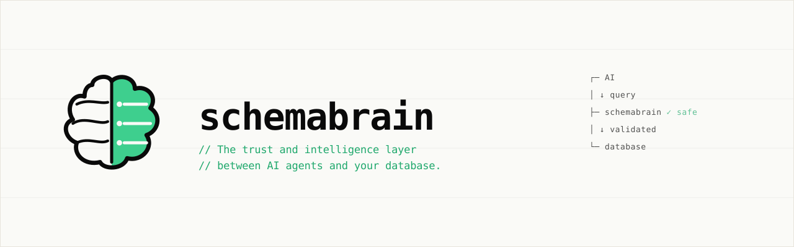
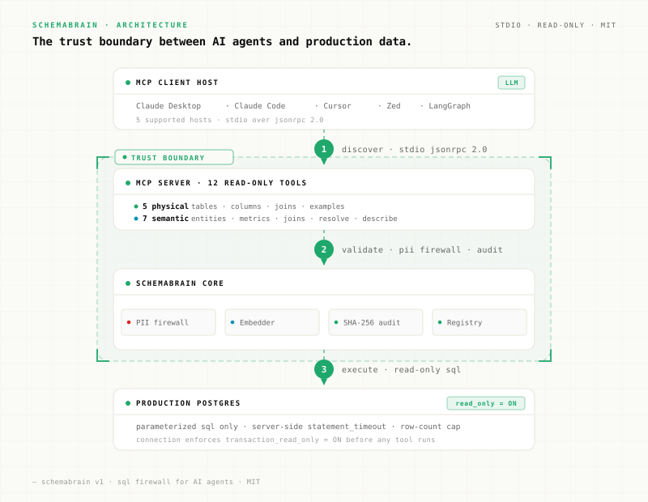
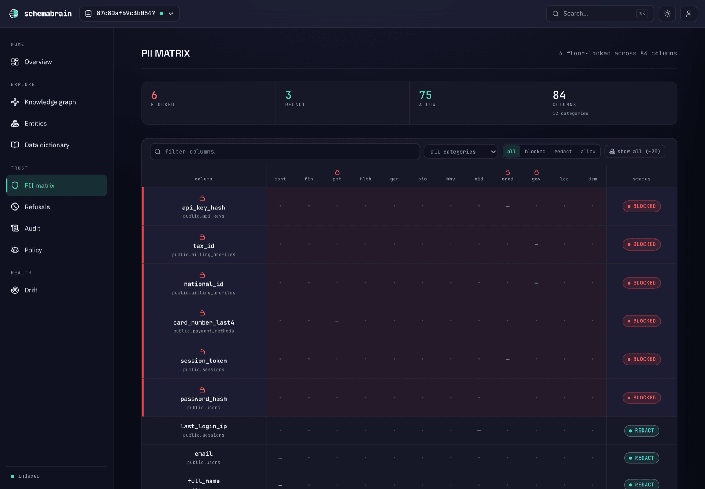
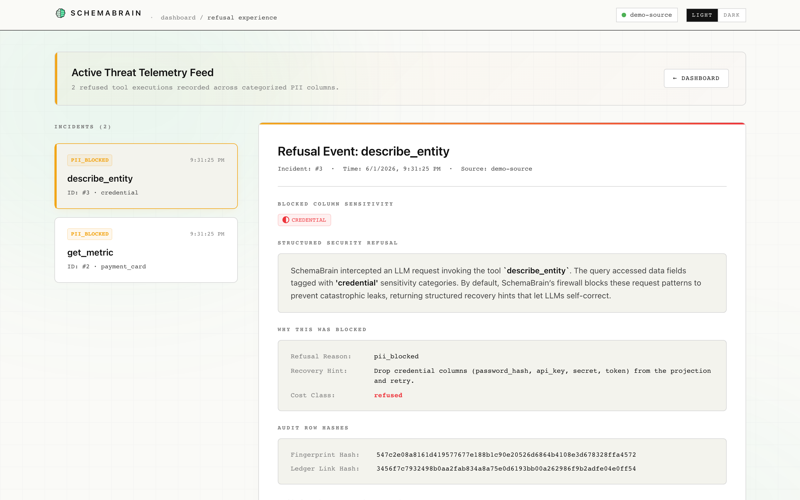
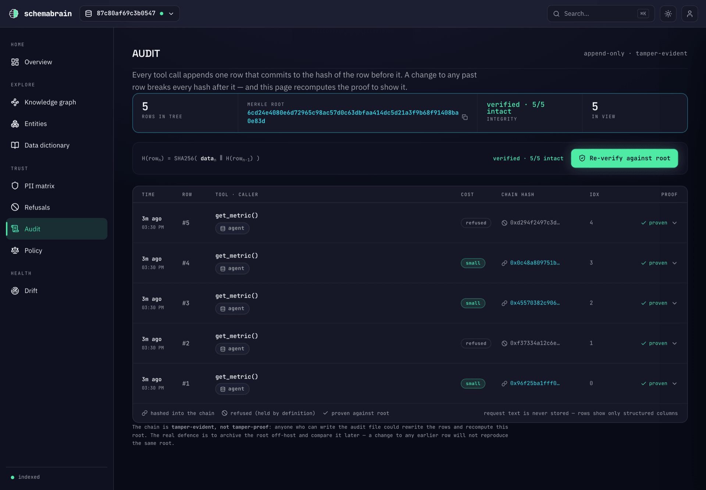

<p align="center">
  <picture>
    <source media="(prefers-color-scheme: dark)" srcset="docs/assets/readme-hero-dark.svg">
    
  </picture>
</p>

<h1 align="center">
  <strong>Stop giving AI agents raw database connection strings.</strong>
</h1>

<h2 align="center">
  Give them SchemaBrain instead — a read-only trust and intelligence layer where the agent never writes SQL, PII is refused before the query runs, and every call lands in a tamper-evident audit log.
</h2>

<p align="center">
  <a href="https://github.com/Arun-kc/schemabrain/actions/workflows/ci.yml"></a>
  <a href="https://pypi.org/project/schemabrain/"></a>
  <a href="https://pypi.org/project/schemabrain/"></a>
  <a href="https://www.python.org/"></a>
  <a href="LICENSE"></a>
  <a href="https://modelcontextprotocol.io"></a>
</p>

<p align="center">
  <em>Works with Claude Desktop · Claude Code · Cursor · Windsurf · any MCP host</em>
</p>

SchemaBrain compiles every query from definitions you control — no path from a prompt to raw SQL at your database.

Three guarantees that close the trust gap between AI agents and your database:

- **[Read-only by architecture](#1-read-only-by-architecture-not-configuration)** — twelve MCP tools, none of which can write. No `execute()` tool, no `query()` tool, no path from agent prompt to a write at your database.
- **[PII refusal at retrieval](#2-pii-aware-refusal-at-the-get_metric-tool-boundary)** — PII tags propagate from the physical schema through joins and metrics. If a query touches a blocked category, SchemaBrain refuses before the database is queried.
- **[Cryptographic audit chain](#3-tamper-evident-audit-log)** — every call, refusal, and recovery is recorded in a SHA256-hashed append-only log (best-effort: a disk-full or no-writer configuration logs a warning and continues rather than failing the query). `audit verify` exits non-zero if any past row was rewritten.

**See it in action** — ask for something the schema can't answer, and it refuses instead of fabricating a join:

> **You:** *compute usage volume by plan tier*
>
> **SchemaBrain → agent:** `{ "kind": "unreachable_entity", "recovery": { "suggested_tool": "resolve_join" } }` — there's no `plan_id` on usage events, so it won't invent one.
>
> **Claude:** I can't fake that join — here's **contracted revenue by plan tier** instead, which actually resolves. ✓

→ [Full session, with the SQL and results](#sample-session)

---

```bash
uvx schemabrain init
# then: Cmd+Q Claude Desktop, relaunch, and ask: "list the entities SchemaBrain knows about"
# prefer a persistent install? pipx install schemabrain (or) pip install schemabrain
```

**Cost:** **$0** to run the bundled demo (pre-curated pack, no API key) · ~$0.03 to LLM-index a fresh 84-column schema · **$0** to re-index unchanged schemas. Detail in [Sample session](#sample-session).

**Status: 0.6.0 (beta).** Postgres supported today (the local store itself is SQLite). SQLite / Snowflake / BigQuery / MySQL source connectors on the roadmap.

---

## Contents

**Read next based on what you need:**

| Goal | Where to go |
|---|---|
| Try it on the bundled fixture | [Quickstart](#quickstart) |
| Understand the safety guarantees | [Safety guarantees](#safety-guarantees) |
| Wire up your MCP client | [Claude Desktop](docs/setup/claude-desktop.md) · [Claude Code](docs/setup/claude-code.md) · [Cursor](docs/setup/cursor.md) · [Windsurf](docs/setup/windsurf.md) · [ChatGPT (roadmap)](docs/setup/chatgpt.md) |
| Plug into your own agent loop | [`docs/setup/manual.md`](docs/setup/manual.md#3-wire-your-own-agent-anthropic-sdk) |
| Build a semantic layer | [`docs/semantic-layer.md`](docs/semantic-layer.md) |
| Run in production (audit, drift, Docker) | [`docs/operations.md`](docs/operations.md) |
| Observe the agent (tail, audit log, OTel) | [`docs/observability.md`](docs/observability.md) |
| Compare with Querybear / Anthropic reference Postgres MCP | [vs Querybear](docs/compare/querybear.mdx) · [vs Anthropic reference](docs/compare/anthropic-postgres-mcp.mdx) |
| Compare with Vanna / Atlan / dbt-mcp / WrenAI | [`docs/landscape.md`](docs/landscape.md) |

---

## Quickstart

> **Just want to see what it does?** `uvx schemabrain demo` — one command, zero prompts. Builds the sample SaaS layer, then lets you open the dashboard or run a terminal firewall showcase. **No API key, and no Docker** for the dashboard / showcase paths. The steps below are for wiring SchemaBrain into your own agent against your own database.

Three steps from `uvx schemabrain init` to a working Claude Desktop integration. If you paste your own Postgres URL — no Docker needed, ~30s. Press Enter for the bundled demo and `init` invokes Docker + downloads a ~67 MB embedding model first time; ~45s once cached.

### 1. Install

```bash
uvx schemabrain init        # zero-install: runs the wizard in one shot
# or install persistently first:
pipx install schemabrain    # (or) pip install schemabrain
schemabrain --version
```

Source install (`git clone` + [`uv`](https://docs.astral.sh/uv/) `sync --extra dev`) is documented in [`docs/setup.md`](docs/setup.md#1-install--run-the-wizard).

### 2. Run the activation wizard

```bash
schemabrain init
```

`init` is a seven-stage wizard that takes you from "I have a Postgres database" to "Claude Desktop can answer questions about it" in one command. On first run it prompts for what it needs:

- **A Postgres URL** — paste your own connection string, or press **Enter** to spin up a local demo Postgres container with the bundled SaaS fixture (Docker is invoked automatically; idempotent on re-runs).
- **An `ANTHROPIC_API_KEY`** — optional. Skip and the wizard still wires Claude Desktop. On the **demo path**, entities + metrics + joins are pre-curated from a bundled YAML pack — the semantic layer works zero-config. On **your own database**, entity curation can run later via `schemabrain entities suggest --apply` once you have a key.

```
SchemaBrain init — activation wizard

  [1/7] Source check       ✓ source reachable + read-only
  [2/7] Index schema       ✓ 12 tables, 84 columns indexed
  [3/7] Curate entities    ✓ 12 entities applied (bundled demo pack)
  [4/7] Curate metrics     ✓ 5 metrics applied (bundled demo pack)
  [5/7] Curate joins       ✓ 11 canonical joins applied (bundled demo pack)
  [6/7] Wire host          ✓ wrote schemabrain entry to claude_desktop_config.json
                           (default; switch with --host claude-code|cursor|windsurf|manual)
  [7/7] Next               ✓ restart your MCP host, then ask: "list the entities SchemaBrain knows about"
```

Full wizard reference (stages explained, flags, dbt auto-detection, `--print-only` for non-Claude-Desktop hosts, `--no-entities` / `--no-metrics` / `--no-joins` opt-outs, cost-cap pauses): [`docs/setup.md`](docs/setup.md#2-what-the-wizard-does).

### 3. Restart Claude Desktop and ask

1. Quit Claude Desktop fully — **Cmd+Q**, not just close the window. The MCP config is only read on cold start.
2. Relaunch.
3. New conversation:

   > list the entities SchemaBrain knows about

If Claude calls `list_entities` and reports `user`, `order`, etc., you're done. If not, see [Troubleshooting](#troubleshooting).

After the wizard, `schemabrain inspect` shows what the agent has and `schemabrain tail` streams every tool call live — see [`docs/operations.md`](docs/operations.md).

---

## Safety guarantees

<p align="center">
  <picture>
    <source media="(prefers-color-scheme: dark)" srcset="docs/assets/readme-architecture-compact-dark.svg">
    
  </picture>
</p>

Six properties SchemaBrain enforces at the SQL boundary today:

### 1. Read-only by architecture, not configuration

The MCP surface exposes twelve tools — **none of which can write**. No `execute()`, no `query()`, no path from agent prompt to a write at your database, regardless of session state — the guarantee is structural, not a flag the agent can flip. `schemabrain serve` also pins `default_transaction_read_only=on` as belt-and-suspenders. [Read-only by architecture →](docs/mechanism/read-only.mdx)

### 2. PII-aware refusal at the `get_metric` tool boundary

Any `get_metric` touching a blocked PII category returns a `refused` envelope — the compiled SQL never runs and the refusal lands in `mcp_audit`. `describe_entity` enforces the same at the column level (blocked columns ship `redacted=True`). `init` blocks the catastrophic-leak set by default (`credential,payment_card,government_id`); `--pii-block` **replaces** the set, so widen by listing the full target. Detection is column-name pattern matching across twelve GDPR / CCPA / HIPAA / PCI categories; content-aware classification is on the roadmap. [PII taxonomy & propagation →](docs/mechanism/pii-taxonomy.mdx)

### 3. Tamper-evident audit log

Every tool call writes one row to an append-only `mcp_audit` table — PII categories, content-addressable fingerprints, sha256 hash chain. `audit verify` re-walks the chain and exits non-zero if any past row was rewritten.

```bash
schemabrain audit verify   # exit 0 = chain clean
```

[Tamper-evident audit chain →](docs/mechanism/audit-chain.mdx)

### 4. Failure is a contract, not a string

Every non-success call — refused, error, or degraded — returns a structured `recovery.suggested_args` block, not a message to parse. PII blocks (`status: "refused"`) ship the entity to retry; ambiguous dimensions and unreachable entities (`status: "error"`) ship the candidate to pick or the next tool to call. Only policy refusals are `refused`; "I won't guess" is `error` with a recovery payload.

```json
{ "status": "error", "kind": "ambiguous_time_dimension",
  "recovery": { "suggested_tool": "get_metric",
                "suggested_args": {"time_dimension": "order.placed_at"} } }
```

[Structured recovery →](docs/mechanism/structured-recovery.mdx)

### 5. Compile path: definitions → parameterized SQL

Entities, metrics, and canonical joins compile to parameterized SQL SchemaBrain runs on its side. The agent sees rows + the SQL that ran — never arbitrary statements at your database. LLM-suggested definitions during `init` are reviewed and applied explicitly. [Build your semantic layer →](docs/semantic-layer.md)

### 6. Pluggable into any agent loop

The same MCP stdio surface Claude Desktop sees is exposed to any MCP host — your own Anthropic, OpenAI, or LangGraph loop included. [`examples/anthropic_demo.py`](examples/anthropic_demo.py) is a ~260-LOC drop-in that wires Claude Haiku 4.5 to `schemabrain serve` and prints exactly which tools the agent chose. [Anthropic SDK walkthrough →](docs/setup/manual.md#3-wire-your-own-agent-anthropic-sdk)

---

## Observability dashboard

SchemaBrain ships an opt-in, read-only dashboard over the same audit + PII + refusal data the MCP server is already writing. `schemabrain dashboard` boots a local FastAPI sidecar serving a pre-built static UI — no Node runtime, no network exposure, no write paths.

```bash
pip install "schemabrain[ui]"
schemabrain dashboard
# → http://127.0.0.1:7878
```

It's a viewer, not a console — no settings, no SQL pad, no write path. **Nine read-only surfaces**, each answering an operator question the MCP envelope alone never surfaces visually. The signature surface is the **Knowledge Graph** — your schema rendered as the same entity-relationship projection the semantic layer compiles joins against:

- **Knowledge Graph** (`/graph`) — *how does my schema actually connect?* Entities as nodes, canonical joins as cardinality-labelled edges, PII-bearing entities flagged, and refusal hotspots highlighted — the schema as a graph, not a table list.
- **Overview** (`/overview`) — the home surface: entity / metric / join / catastrophic-PII counts at a glance.
- **Entities** (`/entities`) — a sortable index; drill into any entity's columns, PII, metrics, and canonical joins.
- **Data Dictionary** (`/dict`) — every table, column, type, PII class, join, and metric, with one-click Markdown export (the same artifact `schemabrain docs` writes).
- **PII Ledger** (`/pii`) — *which entities carry sensitive data?* A heatmap with one row per confirmed entity and one column per PII category, each cell counting how many columns inside that entity carry that category. Entities holding a catastrophic-leak category (`credential`, `payment_card`, `government_id`) get a gutter marker — so you can see at a glance which entities will trip the default `--pii-block` policy, and catch a `payment_card` column hiding inside `users` before you point an agent at a new schema. Each row also carries the entity's origin, inference method, and validation state for triaging mis-tags.
- **Refusals** (`/refusals`) — *what did SchemaBrain block, and what did the agent see?* A two-pane timeline: refused incidents on the left, the full envelope on the right — the reason that fired (`pii_blocked`, `allowlist_violation`, `fragment_unsafe`, `cost_cap_exceeded`, `ambiguous_resolution`, `schema_drift`), the exact category set that intersected the policy, and the `follow_up_hints` the agent got back to recover. Use it to triage "the agent says it can't access that" and to review whether those hints actually helped.
- **Audit Viewer** (`/audit`) — *is the audit chain still intact?* The visual face of the tamper-evident log: every tool call writes exactly one row — whatever the outcome — anchored by `chain_hash = sha256(prev_hash || canonical(row))`. A ribbon shows **Chain Intact** / **Mismatch**, the **Verify** button re-walks the chain *and* checks per-row Merkle inclusion proofs server-side, and selecting a row opens the full body (tool, status, cost class, PII categories, fingerprint, and the prev → row → next hash linkage). Live calls stream in over SSE.
- **Policy** (`/policy`) — the block / redact / allow grid the firewall enforces, with the always-on catastrophic-leak floor disclosed (it can't be removed). Changes are made via copy-the-CLI actions — the dashboard never writes.
- **Drift** (`/drift`) — config and enrichment drift the store can detect, each with a copy-the-CLI fix.

<p align="center">
  <br>
  <em>PII Ledger — which entities carry catastrophic PII, and what the default policy blocks.</em>
</p>

<details>
<summary><strong>More dashboard views</strong> — Refusals &amp; Audit Viewer</summary>

<p align="center">
  <br>
  <em>Refusals — every blocked call, the reason that fired, and the recovery hint the agent received.</em>
</p>

<p align="center">
  <br>
  <em>Audit Viewer — the tamper-evident chain, verified server-side down to each row's hash linkage.</em>
</p>

</details>

The dashboard binds **`127.0.0.1` only** — there is no `--host` flag, by design. It's read-only and reads the same SQLite store `serve` writes to. No agent talks to it.

[Dashboard guide →](docs/dashboard/overview.mdx) · [PII Ledger →](docs/dashboard/pii-ledger.mdx) · [Refusals →](docs/dashboard/refusals.mdx) · [Audit Viewer →](docs/dashboard/audit-viewer.mdx)

---

## Works with

SchemaBrain speaks the [Model Context Protocol](https://modelcontextprotocol.io) over **stdio**. `schemabrain init --host <X>` writes first-party config for four MCP clients; everything else that speaks MCP stdio works via `--host manual` (prints the snippet, you paste).

### First-party wiring

`schemabrain init --host <X>` writes the MCP entry directly into the host's config file.

| Client | Setup guide | Config path |
|---|---|---|
| **Claude Desktop** | [`/setup/claude-desktop`](docs/setup/claude-desktop.md) | macOS: `~/Library/Application Support/Claude/claude_desktop_config.json`<br>Windows: `%APPDATA%\Claude\claude_desktop_config.json` |
| **Claude Code** | [`/setup/claude-code`](docs/setup/claude-code.md) | Shells out to `claude mcp add` |
| **Cursor** | [`/setup/cursor`](docs/setup/cursor.md) | `~/.cursor/mcp.json` |
| **Windsurf** | [`/setup/windsurf`](docs/setup/windsurf.md) | `~/.codeium/windsurf/mcp_config.json` |

### Any other MCP stdio host

`schemabrain init --host manual` prints the JSON entry to stdout — paste it into whatever host config you're using. Any client that launches a subprocess and speaks MCP stdio should work in principle; we have not exhaustively tested each. Common targets:

- **Zed** — full walkthrough at [`docs/setup/zed.md`](docs/setup/zed.md)
- **Codex CLI** (working path for ChatGPT users) — full walkthrough at [`docs/setup/codex.md`](docs/setup/codex.md)
- **Cline** (VS Code extension) — paste into the MCP server settings
- **Continue** — paste into `~/.continue/config.json`
- **Your own agent loop** — see [`examples/anthropic_demo.py`](examples/anthropic_demo.py) for a ~250-LOC Anthropic-SDK reference

The 12-tool surface, PII-aware refusal, audit chain, and recovery contracts are transport-agnostic — any compliant stdio MCP client gets the same guarantees.

### Agent frameworks

The same stdio MCP surface is reachable from any framework that can spawn an MCP server. The Anthropic SDK path is first-party-tested; the others work in principle if the framework's MCP integration speaks stdio.

- **Anthropic SDK** — first-party walkthrough at [`docs/setup/manual.md`](docs/setup/manual.md#3-wire-your-own-agent-anthropic-sdk); reference loop at [`examples/anthropic_demo.py`](examples/anthropic_demo.py)
- **LangChain / LangGraph** — via [`langchain-mcp-adapters`](https://github.com/langchain-ai/langchain-mcp-adapters)
- **Pydantic AI** — via its [built-in MCP support](https://ai.pydantic.dev/mcp/)
- **CrewAI / AutoGen / Agno / custom loops** — any framework with a stdio MCP client works in principle; we have not tested each

We don't ship per-framework adapters; the framework's standard MCP client is sufficient.

### Not yet supported (cloud / HTTPS hosts)

SchemaBrain v0.6 ships stdio only — no HTTPS / SSE transport. Clients that require a cloud HTTPS endpoint do **not** work today:

- **ChatGPT Connectors** — see the [honest gap page](docs/setup/chatgpt.md) for workarounds and the v0.5+ roadmap
- **Hosted MCP gateways** — by design (local-first wedge; see [vs Querybear](docs/compare/querybear.mdx))

If you need ChatGPT support today, a community stdio→HTTPS bridge (`mcp-remote`, `mcp-proxy`, etc.) may work; we have not validated any specific bridge against the PII / audit / recovery semantics.

[Security posture for procurement / review →](docs/security.md)

---

## Sample session

Real Claude Desktop session against the bundled SaaS fixture (12 tables, 84 columns, 12 entities). Condensed for length — a real agent explores `list_metrics` / `suggest_joins` first, then concludes the path is unreachable:

> **You:** Using SchemaBrain, compute our usage volume broken down by plan tier.
>
> **Claude:** *(calls `get_metric(name="usage_volume", group_by=["plan.title"])`. The metric anchors on `usage_event`; reaching `plan` would need a join that isn't in the schema, so it refuses:)*
>
> ```json
> { "status": "error",
>   "error": {
>     "kind": "unreachable_entity",
>     "message": "entity 'plan' is not reachable from metric anchor 'usage_event'; no canonical join exists. Run `schemabrain joins suggest` to surface candidate joins.",
>     "recovery": { "suggested_tool": "resolve_join",
>                   "suggested_args": { "entity_a": "usage_event", "entity_b": "plan" } } } }
> ```
>
> *(Claude confirms at the join layer — `resolve_join("usage_event", "plan")` returns `kind: no_canonical_join`. `usage_events` carries only `workspace_id`, never a `plan_id`, and no table bridges the two.)*
>
> Verdict up front: I can't compute usage-by-plan, and you shouldn't want me to fake it — there is no modeled relationship between usage events and plans in this schema. `usage_events` records a `workspace_id`, not a plan, and nothing joins the two. "Usage volume by plan tier" is unanswerable until that link exists — and I'm not going to invent it.
>
> What I **can** give you — contracted revenue by plan tier (this path fully resolves: `subscription_item → subscription → plan`, both `fk_constraint` joins, `confidence: HIGH`):
>
> ```sql
> SELECT p.title                                     AS plan_tier,
>        SUM(si.unit_price_cents * si.seats) / 100.0  AS revenue   -- prices stored in integer cents
> FROM   public.subscription_items si
> JOIN   public.subscriptions      s ON si.subscription_id = s.id
> JOIN   public.plans              p ON s.plan_id          = p.id
> GROUP BY p.title
> ORDER BY revenue DESC;
> ```
>
> | plan_tier  | revenue     |
> |------------|-------------|
> | Enterprise | $379,620.00 |
> | Pro        | $539.00     |
> | Free       | $54.00      |
>
> Two honest caveats:
> - **Contracted, not collected.** This is subscription line-item revenue (`seats × unit_price_cents`), not paid invoices. For billed totals, the `total_revenue` metric anchors on `invoices` instead.
> - **Integer cents.** `unit_price_cents` is stored as an integer; the `/ 100.0` converts to currency.

The differentiator is what *didn't* happen: most LLM-over-database tools, asked for usage-by-plan, would confidently emit `JOIN plans p ON usage_events.plan_id = p.id` against a `plan_id` column that doesn't exist. SchemaBrain refused — `get_metric` returned `kind: unreachable_entity` with `recovery.suggested_tool: resolve_join`, not prose. The agent **acted on the structured recovery contract programmatically** instead of fabricating a join. Refusal-not-fabrication is the safety mechanism, demonstrated live.

**Cost.** ~$0.0004/column with Claude Haiku 4.5 (cryptic-name columns can opt into Sonnet 4.6 via `--enable-sonnet`). The bundled 12-table fixture (84 columns, 12 entities + 5 metrics + 11 joins) ships pre-curated, so the demo path applies it for **$0** — no API key. Indexing those 84 columns with LLM column descriptions measured **~$0.034**. The Pagila DVD-rental sample (87 columns after partition deduplication) runs for **$0.0299 in 105s**. Re-indexing an unchanged schema is **$0** — content-addressable fingerprinting skips the LLM call entirely.

To verify Claude's SQL is mechanically correct (and that flagged caveats are the actual data behavior), see [Validating SQL Claude generates](docs/setup/manual.md#6-validating-sql-claude-generates).

**Run this exact session yourself:** `schemabrain init` walks you to a wired Claude Desktop in one command; then ask Claude *"Using SchemaBrain, compute our usage volume broken down by plan tier."* and watch the refuse-then-pivot live.

---

## Where it's going

SchemaBrain is evolving into a **trust and intelligence layer between AI agents and your database** — it gives the agent a semantic map of your schema, compiles answers from definitions you control, and keeps every call PII-aware and audited. SQL-boundary safety is one proof-point of that layer, not the whole identity.

That posture rests on a semantic substrate. You can't refuse "this query touches PII" without knowing which columns are PII. You can't answer "join through this junction" without canonical-join definitions. You can't serve a metric without knowing its grain.

So the engineering order is **schema intelligence → semantic substrate → trust primitives.** Today the agent never writes raw SQL: it calls `get_metric` and the semantic-layer tools, SchemaBrain compiles parameterized SQL the agent never sees, and you get PII-aware refusal, structured recovery on every refused or degraded call, read-only execution with statement timeouts and row caps, and a tamper-evident audit chain. That def-driven, compiled-SQL posture is the default and the recommended one. Inspecting arbitrary agent-emitted SQL (`validate_query` / `execute`) is a later, optional opt-in lane — not the direction we're pivoting to. See the [Roadmap](#roadmap).

---

## Roadmap

> The `v0.5` / `v1` / `v2` / `v3` labels are **roadmap milestone names**, not package versions. The package follows strict semver — `1.0.0` is reserved for an API that's been battle-tested by external users without a forced break. See [ADR-0003](docs/adr/0003-versioning-policy.md).

The full, living roadmap — including explicit non-goals and how to influence priorities — lives in [`ROADMAP.md`](ROADMAP.md).

### Now — shipping in v0.6.x

What you get from `pip install schemabrain`:

- **MCP server, 12 read-only tools** — `find_relevant_tables`, `find_relevant_entities`, `describe_table`, `describe_column`, `describe_entity`, `list_entities`, `list_metrics`, `list_joins`, `suggest_joins`, `resolve_join`, `get_example_queries`, `get_metric`.
- **Def-driven compilation** — the agent never writes raw SQL; answers compile from definitions you control, with read-only execution enforced at the database layer plus statement timeouts and row caps.
- **Schema-intelligence engine** — index Postgres into a local SQLite store; cost-capped LLM semantic enrichment (with opt-in Sonnet routing for cryptic columns, `--enable-sonnet`); on-device embeddings (BAAI/bge-small ONNX); hybrid retrieval (bge query-prefix + BM25 via RRF); entity identification with rationale + confidence; declared-FK, query-log, and dbt-`relationships` join mining; a persisted canonical join graph with multi-hop BFS; and a metrics layer.
- **Trust & safety** — PII classification (60 rules across 12 categories) with per-column confidence, tag propagation, a catastrophic-leak floor (grouping *by* a PII column refuses as row-level disclosure), an editable policy (block / redact / allow plus per-column overrides), and a tamper-evident sha256 hash-chained audit log with browser-verifiable RFC-6962 Merkle proofs and `audit verify`.
- **Graph-led dashboard, 9 surfaces** — a signature interactive **Knowledge Graph**, plus **Overview**, **Entities** (sortable index + drilldown with a semantic pane), **Data Dictionary** (Export-to-Markdown), **PII Ledger**, **Refusals**, **Audit Viewer**, an editable **Policy** editor, and **Drift** intelligence. Dual-theme, opt-in, read-only, `127.0.0.1`-only.
- **CLI** — `init`, `demo`, `index`, `import dbt`, `inspect`, `diff`, `check`, `entities`, `joins`, `metrics`, `policy {show, apply, tag}`, `docs`, `dashboard`, `doctor`, `serve`, `audit`. Distributed on PyPI (Apache-2.0 licensed) and as a headless Docker image.

### Later — roadmap (deferred; future direction only)

**Phase 2 — differentiators**

- Query cost estimation (`EXPLAIN` of the compiled SQL)
- Tenant-isolation detection — missing-filter and cross-tenant-join checks
- Impact analysis across definitions
- Usage intelligence — hotspots and dead-table detection
- A general policy-rule grammar
- Implicit-FK discovery without query logs
- Context budgeting for tool responses

**Phase 3 — exploratory**

- Persistent agent memory
- Multi-agent coordination
- Remote MCP transport plus a thin client SDK
- An **optional, opt-in agent-authored-SQL lane** (`validate_query` / `execute`) behind an explicit flag. Def-driven compiled SQL stays the **default and recommended** posture; this lane is for teams that want parse-before-execute over arbitrary agent-emitted SQL, should it land. It is not shipped, and it is not a planned pivot away from the def-driven default.

Everything on this roadmap is open source.

---

## Troubleshooting

The five most common first-run failures. Full troubleshooter in [`docs/setup/manual.md`](docs/setup/manual.md#5-troubleshooting).

- **`pip install schemabrain` gave me an older version.** Check `schemabrain --version`. If it doesn't match the [latest release](https://pypi.org/project/schemabrain/) your pip cache is stale — run `pip install --upgrade schemabrain`. `schemabrain init` writes the same version into the Claude Desktop snippet so it stays reproducible across restarts. When you installed from PyPI **and** `uv` is on your PATH, the snippet runs `uvx schemabrain==<pin>` (bump the pin manually after a pip upgrade); otherwise — a non-PyPI install (local wheel, editable, or git checkout) or no `uvx` — it pins the absolute path of the installed `schemabrain` entry point, which tracks the environment you ran `init` from.
- **`init` reports `source unreachable`.** Postgres may not be ready on first run — wait a few seconds and re-run. For your own database, verify host, port, and credentials. Connection URLs in any form are accepted (`postgresql://`, `postgres://`, `postgresql+psycopg://`).
- **The first `init` or `schemabrain index` hangs for ~60 seconds.** Normal. The first index downloads the ONNX embedding model (~67 MB) and makes one LLM call per column. Subsequent runs are fast.
- **`init` fails at stage 6 "wire host".** Claude Desktop must be installed first — SchemaBrain writes into its config file, which doesn't exist until Claude Desktop has launched at least once.
- **Claude Desktop doesn't show SchemaBrain after restart.** Cmd+Q is required (close-window doesn't trigger a re-read of MCP config). Run `schemabrain doctor` to verify the config landed. If `doctor` says everything's good but Claude Desktop still doesn't see the tool, check `~/Library/Logs/Claude/mcp*.log`.
- **Apple Silicon + Python 3.12.** `fastembed`'s `onnxruntime` dependency ships no arm64 wheel for Python 3.12+, so embeddings can't build. `init` catches this at preflight and tells you to either use Python 3.11 (e.g. `pyenv local 3.11.10`) or re-run with `--no-embed` (keyword search instead of semantic — everything else works).

---

## Documentation

| Doc | What's inside |
|---|---|
| [`docs/setup.md`](docs/setup.md) | Activation wizard (recommended) — pick a host, run the wizard, ask the agent (~60s) |
| [`docs/setup/docker.md`](docs/setup/docker.md) | Docker install (image with embedding model baked in, no first-run download) |
| [`docs/setup/manual.md`](docs/setup/manual.md) | Manual `index`, mine-queries, logs config, troubleshooting, MCP Inspector, SQL-validation ladder |
| [`docs/first-5-queries.md`](docs/first-5-queries.md) | What to actually *do* after `init` — five queries that exercise read-only, PII refusal, audit chain, and structured recovery |
| [`docs/semantic-layer.md`](docs/semantic-layer.md) | Building entities, metrics (incl. composite expressions), canonical joins (incl. multi-hop), dbt import |
| [`docs/operations.md`](docs/operations.md) | `inspect`, `check` (drift), `index --dry-run`, Docker compose |
| [`docs/observability.md`](docs/observability.md) | `tail`, audit log, OTel export, PII classification |
| [`docs/reference/mcp-tools/overview.mdx`](docs/reference/mcp-tools/overview.mdx) | Full reference for all 12 MCP tools (overview + 12 per-tool pages) |
| [`docs/architecture.mdx`](docs/architecture.mdx) | Pipeline, retrieval contract, cache logic, cost model, eval |
| [`docs/dashboard/overview.mdx`](docs/dashboard/overview.mdx) | Read-only observability dashboard — PII ledger, refusals, audit viewer |
| [`docs/landscape.md`](docs/landscape.md) | Comparison vs Vanna / Atlan / dbt-mcp / WrenAI; "is this a semantic layer?" |
| [`docs/threat-model.md`](docs/threat-model.md) | Security model + boundaries |
| [`docs/adr/`](docs/adr/) | Architecture decision records (audit/PII taxonomy, store protocol, versioning policy, observability bus) |
| [`examples/`](examples/) | Copy-paste-ready MCP configs, headless agent loop, end-to-end ecommerce walkthrough |

---

## FAQ

**Does my data leave my machine?**
Only LLM-enriched column descriptions and the redacted sample values that feed them. Three regex passes (email, US SSN, credit-card-shaped digit runs) run on every sample before it leaves the profiler module — see [`schemabrain/profiler/stats.py`](schemabrain/profiler/stats.py). The Anthropic API call sends column metadata + redacted samples + sibling-column context — no raw rows. Embeddings are generated locally via `fastembed` (BAAI/bge-small-en-v1.5, ONNX, ~67 MB).

**What databases work today?**
Postgres 16+ is the only **source** connector today (the local store itself is a SQLite file). A SQLite *source* connector, plus Snowflake / BigQuery / MySQL, is mostly a new `DataSource` implementation plus a profiler tweak — on the v1.x roadmap.

**Why MCP and not a REST API?**
The consumer is an agent, not a service. MCP standardizes tool registration, schema description, and request/response transport. Agents discover SchemaBrain natively and get its tool surface — no API wrapper, no SDK to maintain per language.

**Is this a semantic layer like Cube or dbt Semantic Layer?**
Not exactly — SchemaBrain is the trust and intelligence layer between AI agents and your database, built on a semantic-layer substrate. Entities, metrics, and canonical joins are first-class persisted definitions (`list_entities`, `describe_entity`, `resolve_join`, `get_metric`), and they make the safety primitives possible — read-only-by-architecture, PII refusal, audit chain. The semantic substrate is the foundation; SQL-boundary safety, including the firewall, is one proof-point of the layer, not its whole identity. Full comparison vs Cube / dbt-mcp / Vanna / WrenAI in [`docs/landscape.md`](docs/landscape.md).

More questions answered in [`docs/setup/manual.md`](docs/setup/manual.md#5-troubleshooting) (why local embeddings, more troubleshooting).

---

## Contributors

<a href="https://github.com/Arun-kc/schemabrain/graphs/contributors">
  
</a>

---

## Contributing & License

PRs welcome. The bar is high — see [`CONTRIBUTING.md`](CONTRIBUTING.md) for the test-first / 99%-coverage / conventional-commits / architecture-invariants checklist. CI enforces all of it.

Bugs and feature requests use the structured templates in `.github/ISSUE_TEMPLATE/`. Issues without a reproduction (bugs) or a clear underlying problem (features) get closed with a request to re-open with the right info.

[Apache 2.0](LICENSE).
